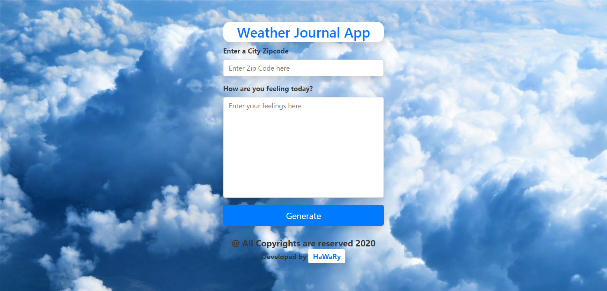

# Weather Journal 
[](https://app.netlify.com/sites/weather-journal14/deploys)

An Asynchronous Weather Web Application, let you get the current Temperature of any City depending on its ZIP Code, built with JSON API, Node JS Environment & Express Framework to create Server Side for Storing the Retrieved Data.  

 

## Objective  

This App is about working with web API's and asynchronous code, creating a web app that uses [OpenWeatherMap.com](https://www.OpenWeatherMap.com) API to get weather based on user's location, and dynamically update UI.

## Demo
 


## Instructions, Building & Getting Started  

* Note that you can not run the App in the Client Side Locally, it must be runned as a Server Side App, so you can follow the few Next Steps :-

    - 1- Fork, clone or download this repository to your local machine.
    - 2- Be sure that you install the [Node.js](https://nodejs.org/en/) environment in your machine.
    - 3- Open your terminal and Be sure that you are inside the correct destination of the App, while you must be in the same path of the server.js file and the website folder.
    - 4- inside your terminal run these commands:-
    
        * to install dependencies.
        ```
        npm install
        ```
        * to start the server.
        ```
        node server.js
        ```
    - 5- Once the app server is running visit (localhost:8000) in the browser to view the app and now you can treat with it as shown above in the Demo.
    
## What Happened Behind the Scenes  

- Make a get request to OpenWeatherMap API to get the location's temperature
- Post a data object to the Express Server.
- This data object is the end-user's input which returns the specific OpenWeatherMap API data with a dynamically-generated date.
- Get data from the Express Server and update the UI dynamically.

## Built With

* HTML
* CSS
* Vanilla JS version ES2015/ES6  

## Enviroment  

* Node JS with Express Framework  

## Dependencies 

* CORS
* Body-Parser

## API'S

* JSON 

## API Credentials

Create API credentials on [OpenWeatherMap.com](https://www.OpenWeatherMap.com)  
  
## Frameworks 

* [Bootstrap 4](https://getbootstrap.com/)

## Google Fonts  

* [Cairo](https://fonts.google.com/specimen/Cairo) 

## Author

* Mohamed Elhawary  

## Contact Me by my Social Accounts

* Email: mohamed.k.elhawary@gmail.com  

* [Linkedin](https://www.linkedin.com/in/mohamed-elhawary14/)

* [Codepen](https://codepen.io/Mohamed-ElHawary)

* [Behance](https://www.behance.net/mohamed-elhawary14)

## Deploy with Me

Feel Free to Deploy it with me, send Issues or a Pull Request and i'll deal with you, just test it First.

## Notices

- This Application is a Practical Project from Udacity Nanodegree Program in the Field of Web Development Professional Track.

## License

Licensed under the [MIT License](LICENSE)